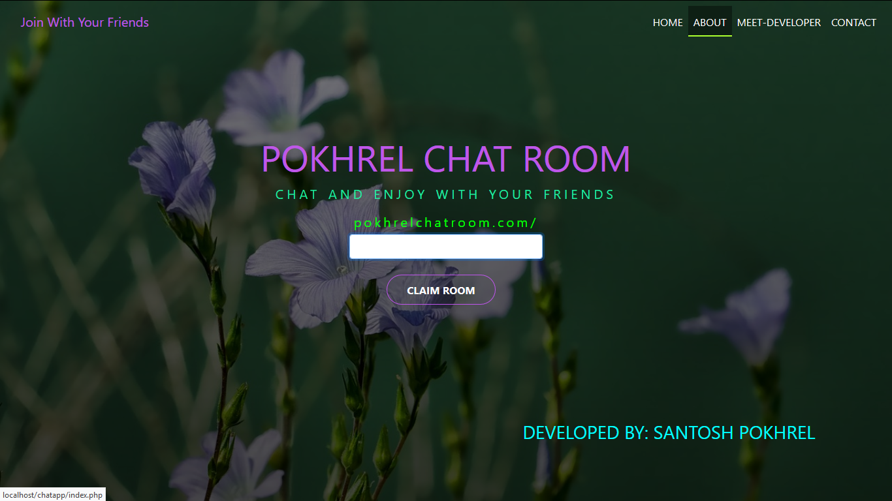

# Chatroom Using PHP
* Hey guys I develop this app using php,msqlin backend and html,css,js in fronend...hope you guys like it.

---
### Requirements
  * Knowledge of html5/css3
  * basic knowledge of php/MYSQL
  * local server : use xampp or wampp
  * paste this project on htdocs if you use xampp and on www if you use WAMPP
  * create database chatroom set your configuration

### Sample
  
  

> Thnank you so much guys...

